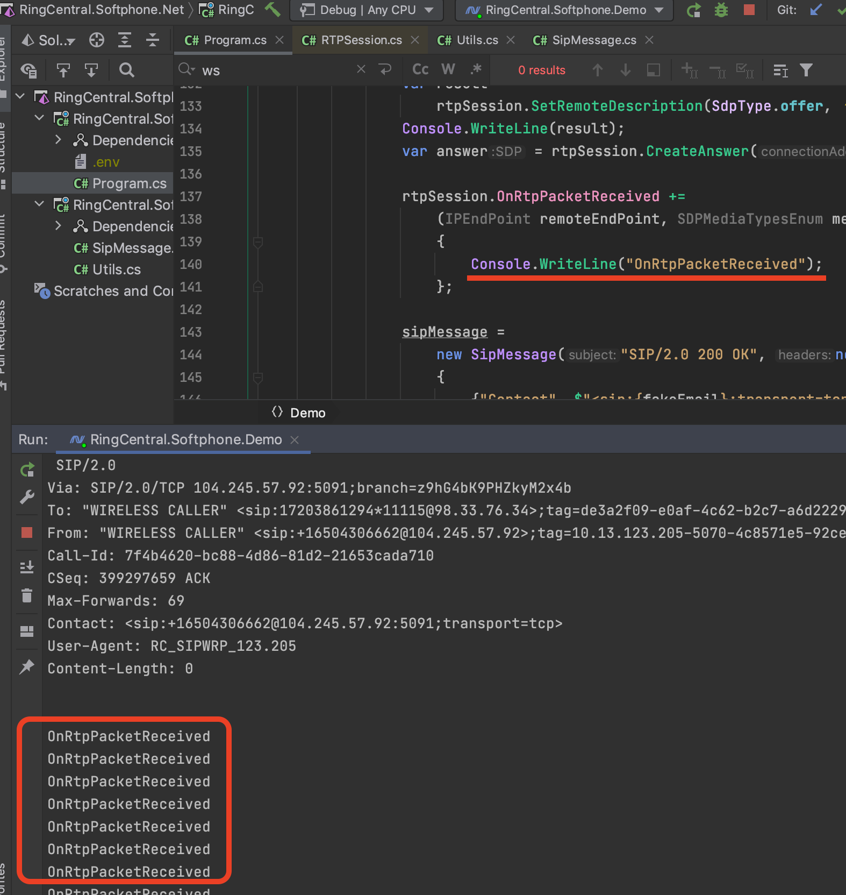

# RingCentral.Softphone.Net

RingCentral Softphone SDK for .NET

This SDK helps you to create a SIP device using SIP over TCP + RTP. WebRTC is NOT used here.

## Screenshot

## Ref 

- https://github.com/sipsorcery-org/sipsorcery/issues/239
